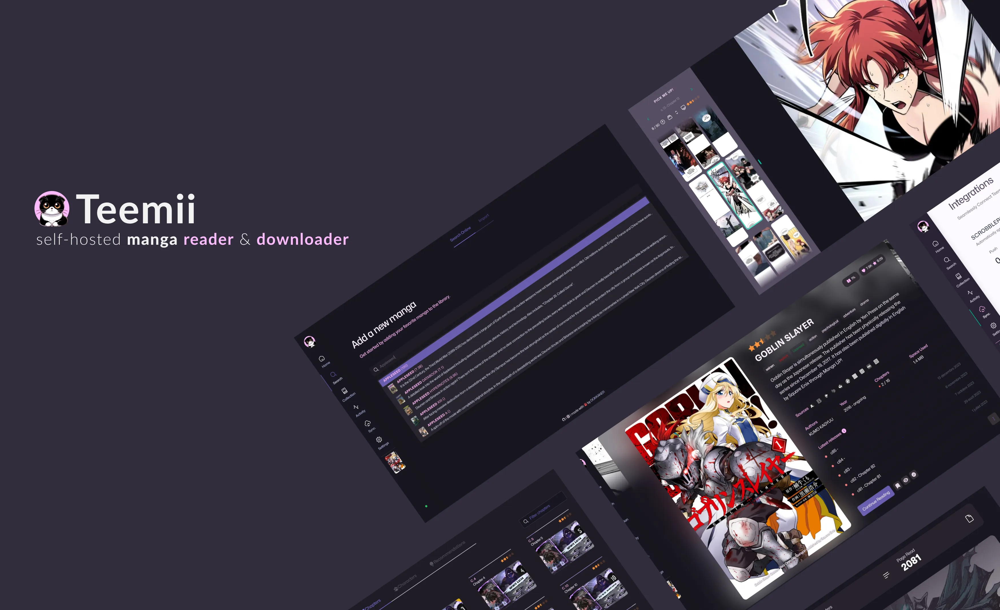
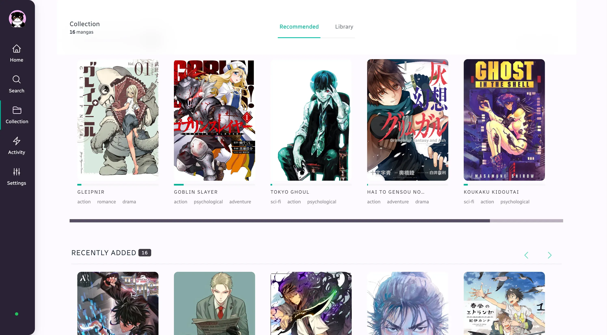

# Teemii

## Overview

**Teemii** is a streamlined web application designed for the avid manga reader. It offers a straightforward and
efficient platform for reading and managing a manga collection.
Key features include cross-platform access, in-browser reading, a powerful metadata aggregator, and automated updates of
your collection.

## New Features

- Scrobbler: Effortlessly sync your reading progress with Kitsu and AniList, keeping your tracking up-to-date across
  your favorite platforms.
- Dark Mode: Enjoy a comfortable reading experience in any lighting condition with the new dark mode.

## Features

- Intuitive User Interface: **Teemii** boasts a user-friendly interface that makes navigation and interaction
  effortless, enhancing the overall user experience.
- Raw Manga Archive Storage: Self-host your manga.
- Cross-Platform Compatibility: Deploy it wherever you want, Access across various devices.
- Customizable In-Browser Manga Reading: Read manga directly in the web browser, no extra software needed.
- CBZ and CBR Format Support: Import and manage popular manga formats.
- Automatic Reading Progress Tracking: Seamlessly keeps track of reading progress.
- Comprehensive Metadata Aggregation: Detailed information for each manga.
- Personalized Manga Recommendations: Suggests new titles based on reading habits.
- Versatile Chapter Fetching: Fetch manga chapters from multiple online sources.

## Getting Started

Check out our documentation for instructions on how to install and run **Teemii**:

https://docs.teemii.io/Quick-Start/

## Preview

## Support

- Check out the [Teemii Documentation](https://docs.teemii.io/) before asking for help.
- You can ask questions in the Help category of
  our [GitHub Discussions](https://github.com/dokkaner/teemii/discussions).
- Bug reports and feature requests can be submitted via [GitHub Issues](https://github.com/dokkaner/teemii/issues).

## Community

You can ask questions, share ideas, and more in [GitHub Discussions](https://github.com/dokkaner/teemii/discussions).
Our [Code of Conduct](CODE_OF_CONDUCT.md) applies to all **Teemii** community channels.

## Contributing

Please read [CONTRIBUTING.md](CONTRIBUTING.md) for details and the process for submitting pull requests to us.

## License

This project is licensed under the MIT License - see the [LICENSE.md](LICENSE) file for details.

## Acknowledgments

- Some of the vue components are based on [headlessui](https://github.com/tailwindlabs/headlessui)
  and [VueForm](https://github.com/vueform)

- Manga data and metadata retrieval are facilitated by various sources.
    - [AniBrainAI](https://anibrain.ai/) for AI-driven anime and manga insights.
    - [AniList](https://anilist.co/)
    - [Bato](https://bato.to/)
    - [ComickFun](https://comick.fun/)
    - [Goodreads](https://www.goodreads.com/)
    - [Kitsu](https://kitsu.io/)
    - [MyAnimeList (MAL)](https://myanimelist.net/)
    - [MangaDex](https://mangadex.org/)
    - [MangaKakalot](https://mangakakalot.com/)
    - [MangaPill](https://mangapill.com/)
    - [MangaUpdates](https://www.mangaupdates.com/)
    - [Nautiljon](https://www.nautiljon.com/) 

